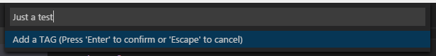
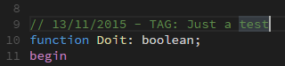

[](https://marketplace.visualstudio.com/items?itemName=alefragnani.tagged-comment)
[](https://marketplace.visualstudio.com/items?itemName=alefragnani.tagged-comment)
[](https://marketplace.visualstudio.com/items?itemName=alefragnani.tagged-comment)
[](https://github.com/alefragnani/vscode-tagged-comment/actions?query=workflow%3ACI)

<p align="center">
  <br />
  <a title="Learn more about Tagged Comment" href="http://github.com/alefragnani/vscode-tagged-comment"></a>
</p>

# What's New in Tagged Comment 2.7

* Adds **Web** support
* Adds **Workspace Trust** support
* Adds **Virtual Workspaces** support
* Adds **Remote Development** support

# Support

**Tagged Comment** is an open source extension created for **Visual Studio Code**. While being free and open source, if you find it useful, please consider supporting it.

<table align="center" width="60%" border="0">
  <tr>
    <td>
      <a title="Paypal" href="https://www.paypal.com/cgi-bin/webscr?cmd=_donations&business=EP57F3B6FXKTU&lc=US&item_name=Alessandro%20Fragnani&item_number=vscode%20extensions&currency_code=USD&bn=PP%2dDonationsBF%3abtn_donate_SM%2egif%3aNonHosted"></a>
    </td>
    <td>
      <a title="GitHub Sponsors" href="https://github.com/sponsors/alefragnani"></a>
    </td>
    <td>
      <a title="Patreon" href="https://www.patreon.com/alefragnani"></a>
    </td>
  </tr>
</table>

# Tagged Comment

It helps you to personalized comments on your code. Set define a template for your comments. You can combine _fixed values_ and _variables_ for richer content. You can even _re-tag_ a comment, adding the previously used tag.

# Features

## Available commands

* `Tagged: Add a Tagged Comment`
* `Tagged: Add a Tagged Comment Line Above`
* `Tagged: Re-Add the Previously Tagged Comment`
* `Tagged: Re-Add the Previously Tagged Comment Line Above`

### Add your tag



### Comment added



## Available variables

The following variables are available:

- `#enteredText` (the tag that you typed)
- `#day`
- `#month`
- `#year`

### Examples

#### Default

The default template just adds the current date:

```
// #day/#month/#year - TAG: #enteredText
```

#### With an issue tracker ID

```
// #day/#month/#year - ISSUE: #enteredText
```

# License

[MIT](LICENSE.md) &copy; Alessandro Fragnani