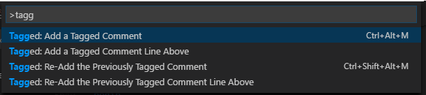

# Functionality

An easy way to add personalized comments to your code

Set your own template for the comment and use _variables_ for richer content. You can even _re-tag_ a comment, adding the previously used tag.

# Usage

### Availble commands



### Add your tag


### Comment added


## Available Variables

The following variables are available:

- `#enteredText` (the tag that you typed)
- `#day`
- `#month`
- `#year`

## Examples

### Default

The default template just adds the current date:

```
// #day/#month/#year - TAG: #enteredText
```

### With an issue tracker ID

```
// #day/#month/#year - ISSUE: #enteredText
```

## TODO List

- Add more variables
- Detect the current language comment pattern (issue [#57](https://github.com/Microsoft/vscode-extensionbuilders/issues/57))
- Define a default comment character for _non-language_ files
- Live preview for the tagged comment while typing
- Add tagged comment above selected lines

## Participate

If you have any idea, feel free to create issues and pull requests

# License

[MIT](LICENSE.md) &copy; Alessandro Fragnani

---

[](https://www.paypal.com/cgi-bin/webscr?cmd=_donations&business=EP57F3B6FXKTU&lc=US&item_name=Alessandro%20Fragnani&item_number=vscode%20extensions&currency_code=USD&bn=PP%2dDonationsBF%3abtn_donate_SM%2egif%3aNonHosted) if you enjoy using this extension :-)